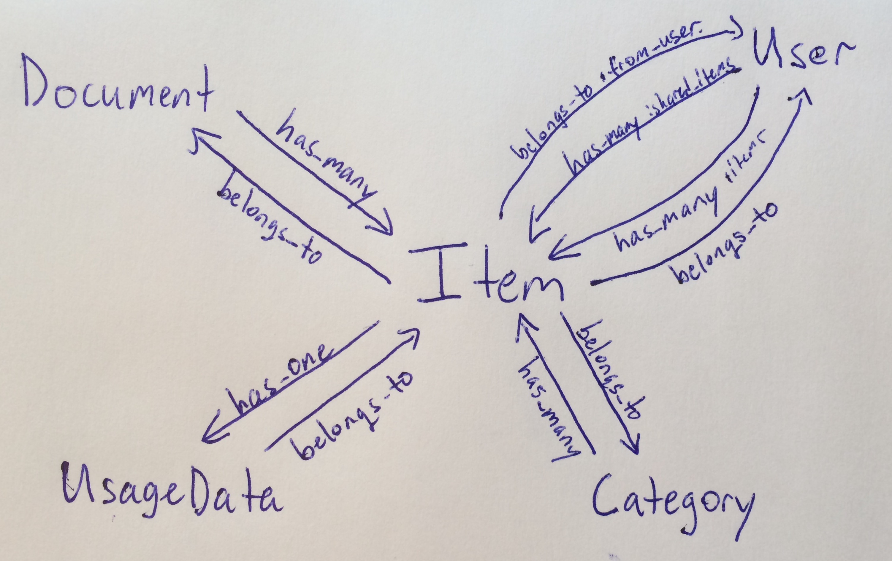

# Sharey

A little passion project. Please go away :)

##API

All responses should be of the form:

####Modals (popups)

    { modal: {headline: "", messages: ["error message 1", "error message 2, ..."] } }
with a :bad_request status (400 or 401) or :success status (200)

*or*

####Listing Items
    { items: 
      { 
        videos:
        {
          description: "",
          url: "",
          TODO: ADD MORE,
        },
        programming:
        {
          description: "",
          url: "",
          TODO: ADD MORE,
        }
      }
    }
with a :success status (200)

## Setup steps 

###Get ngrok up and running for port fowarding:

1. Navigate to the 'ngrok' directory
2. ```$ ./ngrok -subdomain=sharey 3000```

###This application uses Figaro for privacy

- Private information shoule be stored in config/application.yml

###To launch a local server

- Use ```$ thin start --ssl``` although I find the deafult rails server works fine.
- Note: config.force_ssl has been set to true in both production.rb and development.rb

###Notes on sessions and user persistance

- A sessions['current\_user\_id'] attribute is used to keep track of users sessions (on the website). A cookie, sharey\_session\_cookie is used for more persistent session storage

	- A few helper methods in the ApplicationController use this to fetch/verify users.
	- This attribute should be destroyed upon leaving the page. It should not persist very long. 
- A cookies[:sharey\_session\_cookie] is used to authorize sharing of items in a more long term way

	- This should get recreated/stored upon each user login
	- This should *not* get destroyed when a user logs out, as we don't want to force users to login on each new share

###Secrets, Privacy - Figaro

I'm using figaro to keep track of all secrets in **config/application.yml**. In particular, the **config/application.yml** file is ignored by git, and the **config/secrets.yml** file references the environment variables setup by Figaro.

Secrets can be stored in here as key, value pairs and will be automatically available as environment variables. For example:

    GMAIL_USERNAME: username

Can be accessed as:

    ENV["GMAIL_USERNAME"]

In tests, these can be accessed as:

    Figaro.env.gmail_username

###Deploying

    $ figaro heroku:set -e production
    $ git push heroku master

###Reset the database

    $ heroku pg:reset DATABASE_URL
    $ heroku run rake db:create db:migrate
    $ heroku restart

## Object Relationships



## Models and Attributes

*Note: More updated versions of these can be found in schema.rb*

####User

  * uid                     : string
  * name                    : string
  * first\_name             : string
  * last\_name              : string
  * email                   : string
  * image                   : string
  * token                   : string
  * refresh\_token          : string
  * sharey\_session\_cookie : string
  * expires\_at             : datetime

####Item

  * document\_id : integer
  * user\_id : integer
  * from_user\_id : integer
  * category\_id : integer
  * description : string
  * original\_request : string

####Category

  * title : string
  * downcase\_title : string
  * user\_id : integer

####UsageDatum 

  * item\_id : integer
  * viewed : boolean
  * deleted : boolean
  * click\_count : integer
  * shared : boolean

####Document 

  * url : string
  * title : string
  * originator\_id : integer

### TODOs

*TODOs for specific models or controllers can be found by searching the project (CMD-shift-f) for 'TODO'*

  1. Create an object for failed requests. Any request that is submitted that has unrecognized tags, or fails for any reason will have a record created that contains the original request, user, reason it failed, etc.
  2. When a new item is shared with other users, it's category should be wiped (or, figure out what to do with the category)

###Useful

Callbacks (in order) in a Rails application: [Callbacks : StackOverflow](http://stackoverflow.com/questions/6249475/ruby-on-rails-callback-what-is-difference-between-before-save-and-before-crea)